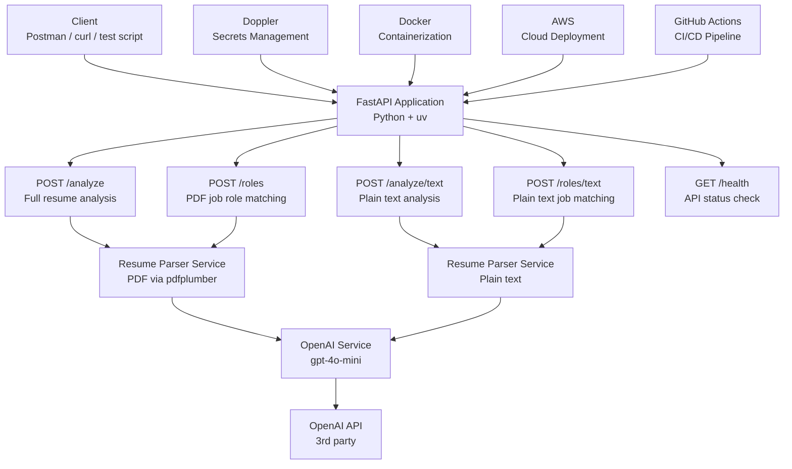

# 🎯 Resume Analyzer API

> An AI-powered resume analysis and job role matching API built with FastAPI and OpenAI.

---

## 📋 Table of Contents

- [Project Overview](#project-overview)
- [Tech Stack](#tech-stack)
- [Project Architecture](#project-architecture)
- [Getting Started](#getting-started)
- [API Endpoints](#api-endpoints)
- [Environment Variables](#environment-variables)
- [Project Structure](#project-structure)
- [Branching Strategy](#branching-strategy)
- [Roadmap](#roadmap)
- [Team](#team)

---

## 🧠 Project Overview

The Resume Analyzer API is a backend-only REST API that uses OpenAI's `gpt-4o-mini` model to:

1. **Analyze resumes** — Given a resume (PDF or plain text), the API returns a structured breakdown including an overall quality score, strengths, weaknesses, key skills, an improved professional summary, and a concrete career recommendation.

2. **Match job roles** — Given a resume (PDF or plain text), the API returns the top 3 job roles that best match the candidate's skills and experience, along with a match score and the key skills that make them a strong fit.

This project is built as part of **CS 3321 — Introduction to Software Engineering** at Idaho State University. The focus is not just on building a working application but on the full engineering lifecycle — clean architecture, testing, secrets management, containerization, CI/CD, and cloud deployment.

---

## 🛠 Tech Stack

| Layer | Technology |
|---|---|
| Language | Python 3.14 |
| Framework | FastAPI |
| Package Manager | uv |
| AI Provider | OpenAI (gpt-4o-mini) |
| PDF Parsing | PyMuPDF (fitz) + pdfplumber |
| Data Validation | Pydantic |
| Secrets Management | Doppler + GitHub Secrets |
| Testing | PyTest + pytest-cov |
| Containerization | Docker + Docker Hub |
| Cloud Deployment | AWS |
| CI/CD | GitHub Actions |
| Version Control | Git + GitHub |

---

## 🏗 Project Architecture



---

## 🚀 Getting Started

### Prerequisites

- Python 3.14+
- [uv](https://astral.sh/uv) installed
- OpenAI API key
- Git

### 1. Clone the Repository

```bash
git clone https://github.com/akkabakovb/Resume_Scanner_SoftwareEngineering.git
cd Resume_Scanner_SoftwareEngineering
```

### 2. Create and Activate Virtual Environment

```bash
uv venv
source .venv/bin/activate  # Mac/Linux
# OR on Windows:
.venv\Scripts\activate
```

### 3. Install Dependencies

```bash
uv sync
```

### 4. Set Up Environment Variables

Create a `.env` file in the root directory:

```bash
touch .env
```

Add your OpenAI API key:

```
OPENAI_API_KEY=your-openai-api-key-here
```

> ⚠️ **Never commit your `.env` file to GitHub. It is already in `.gitignore`.**

### 5. Run the Application

```bash
uv run uvicorn main:app --reload
```

### 6. View API Documentation

Open your browser and go to:

```
http://localhost:8000/docs
```

You will see the interactive FastAPI docs where you can test all endpoints directly.

---

## 📡 API Endpoints

### `GET /health`
Check if the API is running.

**Response:**
```json
{
  "status": "ok",
  "version": "1.0.0"
}
```

---

### `POST /analyze`
Upload a PDF resume for comprehensive AI-powered analysis.

**Request:** `multipart/form-data` with a `file` field containing a PDF.

**Response:**
```json
{
  "filename": "resume.pdf",
  "analysis": {
    "score": 85,
    "strengths": [
      "Strong technical skills in machine learning",
      "Relevant research experience",
      "Clear educational path"
    ],
    "weaknesses": [
      "Lacks internship or industry experience",
      "Summary could be more specific about goals"
    ],
    "skills": [
      "Machine Learning & Deep Learning",
      "Python",
      "Data Analysis & Visualization"
    ],
    "improved_summary": "Detail-oriented Computer Science student...",
    "recommendation": "Seek internships or co-op positions to gain practical experience."
  }
}
```

---

### `POST /analyze/text`
Submit resume as plain text for comprehensive AI-powered analysis. Useful for quick testing.

**Request:**
```json
{
  "resume_text": "John Doe, Software Engineer with 3 years of Python experience..."
}
```

**Response:** Same structured format as `POST /analyze` but without filename.

---

### `POST /roles`
Upload a PDF resume and discover the top 3 job roles that best match your skills.

**Request:** `multipart/form-data` with a `file` field containing a PDF.

**Response:**
```json
{
  "roles": [
    {
      "title": "Machine Learning Engineer",
      "reason": "Strong Python and deep learning experience aligns well.",
      "match_score": 90,
      "key_skills": [
        "Python",
        "Machine Learning",
        "Deep Learning"
      ]
    },
    {
      "title": "Data Scientist",
      "reason": "Experience with data analysis and visualization.",
      "match_score": 85,
      "key_skills": [
        "Data Analysis",
        "Python",
        "Visualization"
      ]
    },
    {
      "title": "Research Assistant",
      "reason": "Current research role aligns with academic positions.",
      "match_score": 80,
      "key_skills": [
        "Research",
        "Technical Writing",
        "Simulation"
      ]
    }
  ]
}
```

---

### `POST /roles/text`
Submit resume as plain text and discover matching job roles. Useful for quick testing.

**Request:**
```json
{
  "resume_text": "John Doe, Software Engineer with 3 years of Python experience..."
}
```

**Response:** Same structured format as `POST /roles`.

---

## 🔐 Environment Variables

| Variable | Description | Required |
|---|---|---|
| `OPENAI_API_KEY` | Your OpenAI API key | ✅ Yes |

> In production, secrets are managed via **Doppler** and **GitHub Secrets**. Never hardcode secrets in your code. A violation of this rule results in an automatic **-15 points** on the final presentation.

---

## 📁 Project Structure

```
Resume_Scanner_SoftwareEngineering/
├── app/
│   ├── __init__.py
│   ├── models/
│   │   ├── __init__.py
│   │   └── schemas.py          # Pydantic request/response models
│   └── routers/
│       ├── __init__.py
│       ├── analyze.py          # POST /analyze and /analyze/text
│       └── roles.py            # POST /roles and /roles/text
├── main.py                     # FastAPI app entry point
├── pyproject.toml              # uv project config and dependencies
├── uv.lock                     # Locked dependency versions
├── .env                        # Local secrets (never committed)
├── .gitignore                  # Files ignored by Git
├── .python-version             # Python version lock
└── README.md                   # You are here
```

---

## 🌿 Branching Strategy

| Branch | Purpose |
|---|---|
| `master` | Production-ready code. Never commit directly. |
| `feature/roles-endpoint` | Built POST /roles and POST /roles/text |
| `feature/analyze-endpoint` | Built POST /analyze |
| `feature/improve-endpoints` | Improved both endpoints with structured responses |

### Workflow

1. Always create a new branch from master for each feature
2. Work on your feature branch
3. Push your branch and open a Pull Request
4. Get it reviewed by a teammate
5. Merge into master

```bash
git checkout master
git pull origin master
git checkout -b feature/your-feature-name
# ... do your work ...
git add .
git commit -m "Your descriptive commit message"
git push origin feature/your-feature-name
# Then open a Pull Request on GitHub
```

---

## 🗺 Roadmap

### ✅ Completed
- [x] Project setup with uv and FastAPI
- [x] API architecture design
- [x] `POST /analyze` — PDF resume analysis
- [x] `POST /analyze/text` — plain text analysis
- [x] `POST /roles` — PDF job role matching
- [x] `POST /roles/text` — plain text job role matching
- [x] `GET /health` — health check
- [x] Structured JSON responses with Pydantic schemas
- [x] OpenAI integration with gpt-4o-mini
- [x] PDF parsing with PyMuPDF and pdfplumber

### 🔄 In Progress
- [ ] Unit tests with PyTest
- [ ] Mock OpenAI API calls in tests

### 📋 Upcoming
- [ ] 80% code coverage with pytest-cov
- [ ] Linting with Ruff
- [ ] Secrets management with Doppler
- [ ] Dockerize the application
- [ ] Push Docker image to Docker Hub
- [ ] Deploy to AWS
- [ ] GitHub Actions CI/CD pipeline (Test → Build → Deploy)
- [ ] Final presentation

---

## 👥 Team

| Name | GitHub | Role |
|---|---|---|
| Bektur Akkabakov | @akkabakovb | Team Lead, /analyze endpoint |
| Koras Koirala | @koras7 | /roles endpoint, endpoint improvements |
| Deepan | - | /roles endpoint |
| Himanshu Jha | @himanshujha05 | /analyze endpoint |

**Course:** CS 3321 — Introduction to Software Engineering
**Instructor:** Ryan Davis
**Institution:** Idaho State University — Spring 2026

---

## 📝 Notes For The Team

- Always pull the latest master before starting work: `git pull origin master`
- Never commit `.env` to GitHub — you will lose 15 points automatically on the final presentation
- Always activate your virtual environment before working: `.venv\Scripts\activate`
- Run the app with: `uv run uvicorn main:app --reload`
- View interactive API docs at: `http://localhost:8000/docs`
- If `uv.lock` has conflicts, delete it and run `uv sync` to regenerate
