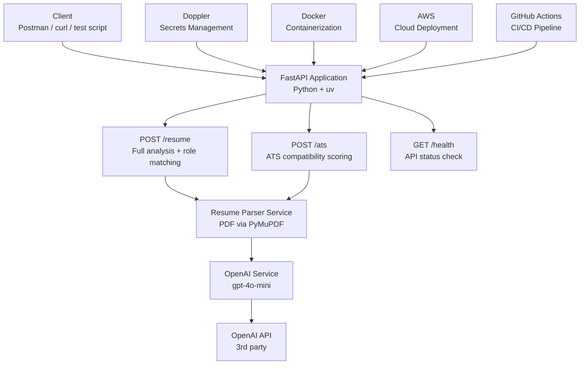
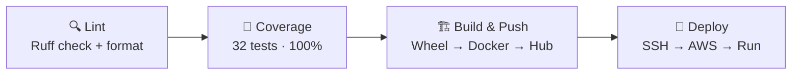

> AI-powered resume analysis and ATS scoring REST API built with FastAPI and OpenAI GPT-4o-mini.

[](https://github.com/akkabakovb/Resume_Scanner_SoftwareEngineering/actions/workflows/deploy.yml)


README.md
9 KB

koraskoirala
koraskoirala
 
Just sleeping 😴
# 🎯 Resume Analyzer API

> AI-powered resume analysis and ATS scoring REST API built with FastAPI and OpenAI GPT-4o-mini.

[](https://github.com/akkabakovb/Resume_Scanner_SoftwareEngineering/actions/workflows/deploy.yml)


---

## 📋 Table of Contents

- [Project Overview](#-project-overview)
- [Live Demo](#-live-demo)
- [Architecture](#-architecture)
- [API Endpoints](#-api-endpoints)
- [Tech Stack](#-tech-stack)
- [CI/CD Pipeline](#-cicd-pipeline)
- [Secrets Management](#-secrets-management)
- [Getting Started](#-getting-started)
- [Running Tests](#-running-tests)
- [Docker](#-docker)
- [Team](#-team)

---

## 🚀 Project Overview

The Resume Analyzer API is a production-grade REST API that uses OpenAI's GPT-4o-mini to provide:

- **Resume Analysis** — Upload a PDF resume and receive an AI-powered analysis including an overall quality score, strengths, weaknesses, key skills, an improved professional summary, and career recommendations.
- **ATS Scoring** — Upload a PDF resume alongside a job description to receive an ATS compatibility score, matched and missing keywords, suggestions for improvement, and a verdict on whether the resume would pass automated screening.

Built as a capstone project for CS 3321 — Introduction to Software Engineering at Idaho State University, Spring 2026.

---

## 🌐 Live Demo

The API is deployed and running live on AWS EC2:

```
http://54.241.193.136/docs
```

Test the endpoints interactively using the Swagger UI at the link above.

---

## 🏗 Project Architecture



---

## 📡 API Endpoints

### `POST /resume`
Upload a PDF resume for a combined AI-powered analysis and job role matching.

**Request:** `multipart/form-data`
- `file` — PDF resume file

**Response:**
```json
{
  "score": 85,
  "strengths": ["Strong Python skills", "..."],
  "weaknesses": ["Lacks certifications", "..."],
  "skills": ["Python", "FastAPI", "Docker"],
  "improved_summary": "Results-driven developer...",
  "recommendation": "Apply for software engineering internships",
  "matched_roles": [
    {
      "title": "Machine Learning Engineer Intern",
      "reason": "Strong ML experience...",
      "match_score": 90,
      "key_skills": ["Python", "TensorFlow"]
    }
  ]
}
```

---

### `POST /ats`
Upload a PDF resume and job description to receive an ATS compatibility score.

**Request:** `multipart/form-data`
- `file` — PDF resume file
- `job_description` — Plain text job description

**Response:**
```json
{
  "filename": "resume.pdf",
  "result": {
    "ats_score": 85,
    "matched_keywords": ["Python", "FastAPI", "Docker"],
    "missing_keywords": ["PostgreSQL"],
    "suggestions": ["Add PostgreSQL experience"],
    "verdict": "Likely to pass ATS screening"
  }
}
```

---

### `GET /health`
Returns API health status.

```json
{
  "status": "ok",
  "version": "1.0.0"
}
```

---

## 🛠 Tech Stack

| Category | Technology |
|---|---|
| Language | Python 3.12+ |
| Framework | FastAPI |
| Package Manager | uv |
| AI Provider | OpenAI GPT-4o-mini |
| PDF Parsing | PyMuPDF (fitz) |
| Validation | Pydantic |
| Testing | pytest + pytest-cov |
| Linting | Ruff |
| Secrets | Doppler |
| Container | Docker |
| Registry | Docker Hub (koras7/resume-analyzer) |
| Cloud | AWS EC2 |
| CI/CD | GitHub Actions (4 jobs) |

---

## 🔄 CI/CD Pipeline

Every push to `master` triggers a 4-job GitHub Actions pipeline:



| Job | Description |
|---|---|
| **Lint** | Runs Ruff linting and formatting checks across all source files |
| **Coverage** | Runs 32 unit tests, enforces 80% minimum coverage using VeryGoodCoverage |
| **Build & Push** | Builds Python wheel, Docker image, pushes to Docker Hub |
| **Deploy** | SSHes into AWS EC2, pulls latest image, runs container with Doppler |

---

## 🔐 Secrets Management

All secrets are managed through **Doppler** with separate `dev` and `prd` configs:

| Secret | Description |
|---|---|
| `OPENAI_API_KEY` | OpenAI API key |
| `HOST` | Server host (`0.0.0.0` in production) |
| `PORT` | Server port (`80` in production) |
| `DOCKER_USERNAME` | Docker Hub username |
| `DOCKER_PASSWORD` | Docker Hub access token |
| `AWS_IP` | EC2 instance IP address |
| `AWS_EC2_USERNAME` | EC2 SSH username |
| `SSH_AWS_PEM` | EC2 SSH private key |

GitHub Actions uses a single `DOPPLER_SERVICE_TOKEN` secret to fetch all production secrets from Doppler at runtime. No secrets are ever hardcoded or stored in the repository.

---

## 🏁 Getting Started

### Prerequisites
- Python 3.12+
- [uv](https://docs.astral.sh/uv/)
- [Doppler CLI](https://docs.doppler.com/docs/install-cli)

### Installation

```bash
# Clone the repository
git clone https://github.com/akkabakovb/Resume_Scanner_SoftwareEngineering.git
cd Resume_Scanner_SoftwareEngineering

# Install dependencies
uv sync --all-groups

# Set up Doppler
doppler setup
```

### Running Locally

```bash
# With Doppler (recommended)
doppler run -- uv run uvicorn src.resume_scanner.main:app --reload

# With .env file
uv run uvicorn src.resume_scanner.main:app --reload
```

Visit `http://localhost:8000/docs` to access the Swagger UI.

---

## 🧪 Running Tests

```bash
# Run all tests
uv run pytest tests/ -v

# Run with coverage report
uv run pytest tests/ --cov=src/resume_scanner/app --cov-report=term-missing

# Run linting
uv run ruff check src/ tests/
uv run ruff format --check src/ tests/
```

**Current test results:**
- ✅ 32 tests passing
- ✅ 100% code coverage
- ✅ All OpenAI calls mocked — no API credits used during testing

---

## 🐳 Docker

### Pull from Docker Hub

```bash
docker pull koras7/resume-analyzer:latest
```

### Run with Doppler

```bash
docker run -p 80:80 \
  -e DOPPLER_TOKEN=your-doppler-service-token \
  koras7/resume-analyzer:latest
```

Visit `http://localhost/docs` to access the Swagger UI.

### Build Locally

```bash
# Build wheel first
uv build

# Build Docker image
docker build -t resume-analyzer .

# Run locally
docker run -p 80:80 \
  -e DOPPLER_TOKEN=your-doppler-service-token \
  resume-analyzer
```

---

## 👥 Team

| Name | GitHub | Contributions |
|---|---|---|
| Bektur Akkabakov | [@akkabakovb](https://github.com/akkabakovb) | Team Lead, /analyze endpoint, Dockerfile, CI/CD pipeline |
| Koras Koirala | [@koras7](https://github.com/koras7) | /ats endpoint, /resume endpoint, unit tests, AWS deployment |
| Deepan | — | /roles endpoint, /ats unit tests |
| Himanshu Jha | [@himanshujha05](https://github.com/himanshujha05) | /analyze endpoint, /resume unit tests |

---

## 📄 License

This project was built for CS 3321 — Introduction to Software Engineering at Idaho State University, Spring 2026.
README.md
9 KB
